# SITE integration plan — PIM Contract v3

Дата: 2026-10-09. Статус: proposal / review only. Ни один шаг реализации ниже не выполнен этим commit.

Базы: SITE pricing `bee58327e859efb618faea3631229de3fd3c1e39`; main `0e7dafa39e632690220d5d93669e571254286388`; PIM release `27fb26056563eb1fcf144ffdb2ba9ab264fa9313`. Main не содержит pricing работу. [Аудит](AUDIT-REPORT.md), [схема/миграция](DB-MIGRATION-PLAN.md), [полевая матрица](PIM-V3-GAP-MATRIX.json).

## Порядок и запреты

После отдельного подтверждения владельца начать с небольшого additive foundation commit. Никакого production apply, mass merge/hide/redirect/publication, настоящих MonoPay/NP/mail операций, destructive SQL или изменения PIM architecture по этому плану не выполнять автоматически.

Сохранить existing products/variants и pricing v1. V3 — явно versioned ingestion/read adapter тех же таблиц, не вторая товарная система. Legacy records остаются readable до confirmed mapping. Новые capabilities остаются выключены до end-to-end реализации соответствующих возможностей. Выпуск status кода раньше sync допустим только как gated configuration; положительное подтверждение contract v3 — после шага 15.

## Обязательные входы до sync/merge

1. Реальный локальный export закреплённого PIM с моделями, colors, SKU, normalized sizes/options, inventory/permissions и version metadata. Production PIM сейчас намеренно блокирует sync.
2. Wire export включает сохранённый pricing v1 для каждого real SKU. В текущем exporter обнаружена потеря этих полей при замене variants (G02). Нельзя обходить ошибку ценовым fallback на сайте.
3. Explicit legacy product/SKU/photo/category mappings и owner-approved resolutions из PIM. Не заменять их similarity. PIM colors используют `id`, одинаковый color id может повторяться у разных моделей: SITE key = `(model_id,color_id)`.
4. Exact PIM143 taxonomy: IDs, parent graph, names и детерминированный hash. Site active136 отличается на 42 old-only /49 PIM-only ID; full diff сохранён в матрице. Сохранить site aliases/locks/banners отдельно от authority PIM.
5. Private authenticated fulfillment payload. Public-only export не гарантирует данные для NP/supplier articles; supplier bindings/provenance нельзя выдавать покупателю.
6. Read-only inventory/export текущей SITE DB и deploy manifest/hash assets. Production state в этом аудите не установлен. Counts/mapping/LOST проверять по этому snapshot, а не старой резервной копии.

Схема PIM draft-07 не описывает colors items, price, часть size/marketing fields. Поэтому будущая validator проверяет schema **и** документированный export extension с ownership/price/privacy rules; не делает вывод «раз schema проходит, контракт полностью поддержан».

## Target chain

```mermaid
flowchart LR
 E[PIM explicit export + mapping] --> V[Auth / version / hash / schema / pricing validator]
 V --> B[Durable validated batch]
 B --> T[Atomic finalize: existing catalog + relations]
 T --> D[Public whitelist MODEL/COLOR/SKU DTO]
 D --> UI[Color gallery + real sizes or request option]
 UI --> Q[Server current selection + quote]
 Q --> R{All selected lines payment-ready?}
 R -->|yes| O[Order READY_FOR_PAYMENT]
 R -->|no request allowed| C[WAITING_CONFIRMATION]
 C --> M[Manager resolves real SKU + current quote]
 M --> O
 O --> I[Revalidate / reserve / idempotent invoice]
 I --> W[Signed authoritative webhook]
 W --> P[Paid snapshot + fulfillment + mail]
```

## Малые implementation commits

| № / commit scope | Существующие файлы и минимальные additions | Проверка и критерий выхода |
|---|---|---|
| 1. SITE CONTRACT + DB FOUNDATION | `api/lib.php`, `shop/store-lib.php`, `dev/prepare-runtime.php`; новые `shop/pim-v3-contract.php`, `dev/migrate-pim-v3.php`, contract fixtures/tests | Version/schema/ownership contract, additive DDL plan/apply CLI только isolated DB; defaults legacy, feature off; pricing116 regression; никаких new positive capabilities |
| 2. Status negotiation (disabled until ready) | `api/index.php`, `shop/taxonomy.php`; подготовка exact category manifest/hash | Negative/default status не утверждает поддержку. Unsupported versions/unknown IDs fail; hash/143 tree deterministic; enable gate только шаг15 |
| 3. Sync v3 ingestion | `api/index.php`, `api/lib.php`, `shop/taxonomy.php`; batch validator/persistence helpers | Dry-run validates no writes; apply isolated only. Same ID/hash replay; changed hash conflict; atomic rejects; explicit hide ACK; absence unchanged; pricing ownership protected; no partial publication across chunks |
| 4. MODEL/COLOR/SKU read API | `shop/catalog-lib.php`, `api/index.php`, `api/lib.php`, `api/perf.php`, photo helpers | Same tables, versioned rows; composite color ownership; private whitelist; order option distinct from SKU; usable-photo gate; correct nullable numeric inventory |
| 5. Catalog/search/filter/taxonomy | `shop/catalog.php`, `shop/catalog-lib.php`, `shop/taxonomy.php`, `shop/canonical-taxonomy.json`, existing classifier bypass, `sitemap.php`, `feeds/feed.php` | One model/count under multi-color/multi-SKU match; PIM structured attrs no text inference; locks/aliases/banners preserved; cached counters match readiness; advertising policy separately tested |
| 6. Selector/gallery + home/mobile | `index.html`, active client version source → new versioned JS; catalog/theme/hero assets as necessary; `storefront.php` SSR | Color id changes gallery/SKU/sizes/prices/perms; one size auto; multiple prompt; NO_SIZE_REQUIRED no fake; null-SKU options request; single hero CTA; 360/390/430 and desktop two themes |
| 7. Cart/quote selection | `shop/store-lib.php`, `shop/checkout-quote.php`, `shop/pricing-policy.php`, active client/runtime | Exact model/color/SKU/normalized size/qty/version. Legacy cart resolve only mapping; typed price/selection conflict; forged IDs/perms rejected; request option not reserved/invoiced |
| 8. Order/payment/fulfillment states | `shop/order.php`, `shop/order-lifecycle.php`, `shop/np-fulfillment.php`; new state reducer helper | Separate state columns + legacy projection; immutable snapshot; request idempotency; paid/cancelled/late events safe; no TTL changes; paid allocation protected |
| 9. Immediate IN_STOCK payment eligibility | `shop/order.php`, `shop/store-lib.php`, `shop/order-lifecycle.php` | Real confirmed SKU/status/price enters READY_FOR_PAYMENT without manager; STATUS quantity null works; no invoice yet if payment adapter not ready; expiry vs warning tests |
| 10. Manager request confirmation | `shop/np-manager.php`, `shop/np-fulfillment.php`, `shop/store-lib.php` | Auth/audit/fresh resolver; options resolve real SKU; current price agreement; confirmed preorder nullable lead time; cannot pay unknown/unpublished; repeat safe |
| 11. MonoPay adapter | `shop/mono-lib.php`, `shop/payment-start.php`, `shop/payment-return.php`, `shop/mono-webhook.php` | Both ready paths use fresh selection before invoice; saved amount immutable; mocks only; signature/amount/currency/hash/retry/unknown outcome; webhook alone online paid; bank status only diagnostics; browser cannot mark paid |
| 12. Legacy URL / SEO | root `.htaccess`, `storefront.php`, `shop/catalog-lib.php`, `sitemap.php`, feeds | Confirmed mapping old URL → model URL + selected color; canonical once; no loops/open redirects; hidden history/restores retain identities; zero-photo SEO exclusion |
| 13. Kit/favorites/recommendations | `api/kits.php`, `shop/kit-data.php`, `shop/kit-catalog.php`, `shop/pricing-policy.php`, `shop/customer.php`, active client | Explicit role/season/compatibility PIM metadata; no fuzzy model grouping; exact SKU+qty prices/reservations; allowed_skus/kit hash ACK; favorites once per MODEL; same-model color not recommendation |
| 14. Customer cabinet projection | `auth/account.php`, `auth/account-view.php`, `auth/account-ui.js`, identity helpers only if needed | Immutable color/size/payment/delivery/TTN; allowed pay action; guest preserved; ownership after verified identities/OTP; no first-stage cabinet rewrite/no phone-only access |
| 15. Staging E2E / readiness manifest | tests/fixtures + deploy/migration runbook; enable status gate only here | Actual PIM export roundtrip, migration invariants, mock checkout/invoice/webhooks, rollback rehearsal, load profile; all advertised capabilities fully implemented; owner sees evidence |
| 16. Production migration | existing deploy tooling + approved CLI, no unattended apply | Separate owner approval, encrypted off-host restore-tested backup, short write gate, mapping/hash/count verification, asset/DB manifest, no test real payment; monitoring/rollback readiness before opening writes |

Этапы 8–11 раздельны для ревью, но immediate payment включается только после завершения всего безопасного payment пути. SEO/feeds и photo predicate затрагиваются на шаге5, не откладываются до последнего commit: иначе zero-photo товары останутся видимыми в части сайта. Public capabilities не активируются на шаге2. Это намеренные уточнения предложенной последовательности.

Первый commit может добавить только fixtures/validators/migration foundation с отключённым v3 route. Не включать capabilities, taxonomy replacement, SKU transfer или новую checkout политику вместе с foundation.

## Request contracts и shared resolver

Один server resolver вызывается quote/order/manager-confirm/invoice/kit validation; frontend не вычисляет доступность.

Реальный выбор: `{model_id,color_id,sku,variant_id?,size,qty,catalog_version,price_mode,kit_group?}`. Обязательность цвета зависит от реального export; если PIM не подтвердил ownership, server не присваивает неизвестный color_id. Отдельный выбор заявки: `{model_id,color_id?,option_id,size,qty,selection_type:"SIZE_OPTION"}`, SKU=null. MODEL-scoped option не подтверждает все цвета. Inventory и pricing поля клиентом не авторизуются.

Под lock сервер проверяет current publication/readiness, confirmed mapping/ownership, real size/SKU, binding, effective availability, three permissions, explicit expiry, quantity if confirmed numeric, quote revision и pricing v1. Stock age/import time/cache age не заменяют supplier observation. Неверные combinations дают typed conflict/rejection, без выбора «похожего» SKU.

Перед invoice дополнительно проверить order state и manager confirmation revision (если нужен), актуальную selection и reservation/allocation, immutable payable amount. Если текущая цена изменилась, не перезаписывать историческую сумму и не создавать новый invoice молча: отдельный re-quote/customer agreement workflow до оплаты. Существующий pending invoice требует reconciliation/cancel по provider правилам, не второй платёж.

## Sync/ACK adapter contract

Использовать существующий `/api/pim/sync`; предложенные поля batch_id/request_hash/schema version/finalize оформляются как negotiated wire contract, а не как уже существующий PIM API. Exact canonical hash алгоритм фиксируется golden fixture (UTF-8 deterministic category serialization) отдельно от SHA256 сырых JSON файлов. Все поля `contract_version:3`, `category_catalog_version:2`, `size_catalog_version:1`, `order_policy_version:1`, `inventory_policy_version:1`, `pricing_policy_version:1` проверяются на соответствующей границе.

Status сообщает exact IDs/hash и только готовые capabilities. ACK после commit: batch/hash/revision/result per model, confirmed versions, explicit `hidden_ids`; неизвестные IDs/ownership не silent alias. Неполный ACK не даёт PIM помечать публикацию успешной. Long exports допускают controlled temporary batch staging private payload без публичного чтения; единый atomic finalize существующих таблиц, bounded chunk size/memory/retries. Только `all_ids` не является командой hide.

UNPUBLISHED — состояние публикации отдельно от supplier enums. Explicit archive/restore сохраняют IDs/media/history; no-image не меняет publication. PIM schema nullable canonical ID валидна для review, но не авторизует публичный неразмеченный model: удержать прежнюю confirmed category или NEEDS_MAPPING; не назначать категорию regex.

## Pricing и quantity

Pricing bee5832 должен быть предком интеграционных commits и будущего main. Не сужать decimal values, не переводить floor в public DTO. PIM approved kit/wholesale и shop promo проверяются на final unit floor; customer grant и exact composition на сервере. Заказы с m² сохраняют decimal quantity, обычные units проверяются typed sale_unit, без name parsing v3. Floor неизвестен → скидка запрещена, а не восстановлена по проценту. Signed provider amount всегда integer kopecks.

## Приёмочные тесты

| Уровень | Обязательный набор и проверяемый результат |
|---|---|
| Schema/unit | Каждый path матрицы; required/null/enum/version; no checkout_allowed; price policy extension; ownership and negative fixtures; full inventory sources; one/no/multiple/request sizes; no fake values |
| DB/integration isolated | Full invalid batch rollback; replay/hash conflict; owner mapping transaction; no absence hide; preserved relations/order snapshots; explicit hide/restore; QUANTITY concurrent checkout and paid allocations; no numeric reservation for STATUS; lock ordering/deadlock retries |
| API/security | Forged model/color/SKU/price/permissions/qty; customer scope/guest tokens; manager auth/CSRF; public whitelist including nested sources/bindings/floor/cost/key canaries; signed webhook amount/currency/time/event guards; SSR/meta/JSONLD/feed leak checks |
| Browser | Color gallery and per-SKU data; reset stale selected size; one/no/request size; changed price prompt; restored legacy carts; kit constraints; single home CTA; no fake/double size choices; mobile360/390/430 + light/dark + desktop |
| Staging E2E mock | Real pinned export → mock sync → model read → exact cart → quote → READY order → mock invoice → signed webhook → paid receipt/account; request option→realSKU confirm→pay; mixed cart agreed policy; mail/NP mocked/outbox inspected |
| Migration | Current SITE snapshot + actual PIM mapping; per-entity conservation, photos/price/stock/category identities; aliases/carts/favorites/orders/items/private supplier links; dry-run and rollback/replay proofs |
| Performance | Staging TTFB/query plans/cache hit/photo bytes/selector latency; parallel different-SKU checkout throughput + hot-SKU race; cold cache/batch sync load/worker limits; bounded errors/Retry-After and no oversell, no production flood |

Нет цели набрать произвольные «500 тестов»: отчёт перечисляет fixtures/assertions/coverage и реальные команды/результат/пропуски. Historical pricing116 не выдавать за v3 тесты. Review stage проверяет только документы/JSON/evidence, не запускает DB E2E с DDL.

## Скорость, устойчивость и безопасность в рамках интеграции

Использовать existing photo WebP/thumb worker/local storage; галереи требуют immutable revisions/explicit sizes, first viewport eager/priority, остальные lazy, минимальный public DTO. Не скачивать supplier full-size изображения при каждом открытии modal; indexed queries и cache warm worker по catalog/media revision. Zero-photo readiness меняет media revision и counts, без полного re-import.

Кэшировать только public DTO/SSR по contract/catalog/taxonomy/media revision и filters. Existing `api/perf.php` уже учитывает catalog_updated/MAX(photo timestamp)/hide flag и отдаёт stale public copy до 5 минут; после explicit hide или утраты всех usable photos старый cache не должен обходить hard public-read gate. Cart/order/manager/account/payment всегда private/no-store; кэш не источник авторизации цены/stock. Избежать полного обхода product_categories на каждом hot request после профилирования. Проверить shared revision lock вместо общего exclusive checkout mutex, ordered per-SKU locks и короткие транзакции без external I/O.

Не обещать 10k simultaneous покупок на shared hosting без measurements. Определить предел через staging профиль CPU/DB/worker throughput, checkout p95/error rate, hot SKU contention, bounded queue. Runtime gates/degradation/Retry-After должны сохранять correctness. Инфраструктурное масштабирование/отдельная managed DB — отдельная будущая задача, не prerequisite docs commit.

При будущей эксплуатации: внешний мониторинг read-only health + synthetic checkout quote без заказов, Telegram/email alerts, независимый heartbeat jobs, encrypted off-host backups/restore drills и журнал payment/webhook. Ничего из этого не объявляется настроенным этим аудитом. История аккаунтов сохраняется в закрытой БД/backup, не в публичном repo/папке banners.

## Evidence и release gates

До production владелец получает: code commit SHA, PIM export hashes, actual deployed manifest, private backup restore proof, mapping/NEEDS_MAPPING report, category diff/locks, per-entity LOST_* report, test results с coverage/skips, mock E2E, perf limit и rollback runbook. Документы и public fixtures не включают данные клиентов/секреты/private supplier evidence.

Все LOST_SKU/VARIANTS/PHOTOS/PRICES/STOCK/CANONICAL_CATEGORIES/ORDERS/ORDER_ITEMS должны быть 0, плюс counts/uniqueness/ownership/aliases. Это **не вычислено для production в этом этапе**. До закрытия G02/G03/ownership и owner review нет массового merge. Не достигать нулей искусственным исключением UNKNOWN/site-only из знаменателя.

## Решения владельца

Первое отдельное подтверждение: foundation scope. Второе business decision: mixed cart whole-order WAITING_CONFIRMATION рекомендуется. TTL и webhook source сохраняются как уже задано. Технические пробелы экспортера/mapping/privacy фиксируются и проверяются разработчиком, без просьбы вручную разобрать весь каталог.
